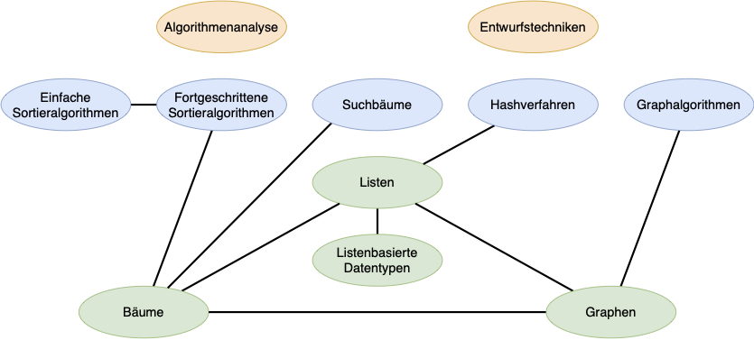

# Praktikum Algorithmen und Datenstrukturen
In diesem Repository finden Sie die Aufgabenblätter für das Praktikum Algorithmen und Datenstrukturen sowie die 
dazugehörigen Java-Dateien.

- Das Praktikum findet einmal in der Woche statt, in den Gruppen, wie sie im Moodle eingeteilt wurden.
- Es gibt neun Aufgabenblätter, die nach und nach freigeschaltet werden. Späteste Abgabe der Aufgabe: zwei Wochen nach
  Freischaltung. Der Abgabetermin steht jeweils im Moodle.
- Die Aufgaben sollen in Gruppenarbeit (2-3 Studierende) gelöst werden.
- Die Abgabe der Lösungen erfolgt ausschließlich über das Gitlab. Im Moodle muss eine Textdatei bzw. ein PDF abgegeben
  werden, in der die Links zu allen zur Abgabe gehörenden Dateien in Gitlab enthalten sind.
- Die Lösungen werden uns dann während des Praktikums gezeigt und erklärt. Sind wir mit der Lösung und Ihrer Erklärung
  zufrieden, bekommen Sie Ihr Testat für die jeweilige Aufgabe.
- Im Praktikum stehen wir für Fragen immer zur Verfügung. Nutzen Sie das, denn das Praktikum ist eine wichtige
  Hilfestellung für die spätere Klausur.

# Aufgaben
- [Aufgabenblatt 1](exercises/Aufgabenblatt_1.md)
- [Aufgabenblatt 2](exercises/Aufgabenblatt_2.md)
- [Aufgabenblatt 3](exercises/Aufgabenblatt_3.md)
- [Aufgabenblatt 4](exercises/Aufgabenblatt_4.md)
- [Aufgabenblatt 5](exercises/Aufgabenblatt_5.md)
- [Aufgabenblatt 6](exercises/Aufgabenblatt_6.md)
- [Aufgabenblatt 7](exercises/Aufgabenblatt_7.md)
- [Aufgabenblatt 8](exercises/Aufgabenblatt_8.md)
- [Aufgabenblatt 9](exercises/Aufgabenblatt_9.md)

# Vorgaben zur Abgabe
- Das Git-Repository muss den Gruppenname als Suffix haben.
- Der Abgabestand muss im Git im main-Branch liegen.
- Alle Textabgaben müssen im Git im Ordner solutions abgelegt werden. Die Dateinamen müssen dabei mit 
  **Aufgabenblattxx_** beginnen. **xx** steht dabei für die Nummer des Aufgabenblatts, also z.B. 02. Nach diesem Präfix 
  kann der Name frei gewählt werden. Verwenden Sie Markdown zur Formatierung der Textabgaben.
- Im Moodle muss eine Textdatei bzw. ein PDF abgegeben werden. In dieser sollten die Links zu allen zur Abgabe 
  gehörenden Dateien in Gitlab enthalten sein.
- Alle Implementierungsklassen müssen im Verzeichnis src/main liegen. Alle Testklassen müssen im Verzeichnis src/test liegen.
- Der Package-Name für abgegebene Source-Dateien muss das entsprechende Aufgabenblatt enthalten.

